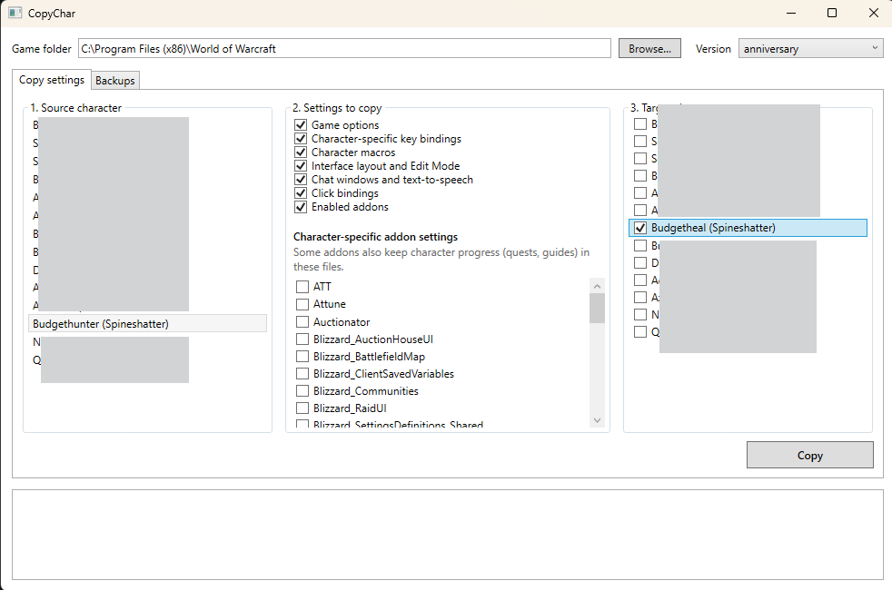

# CopyChar

Windows tool that copies the settings of a World of Warcraft Classic character (Anniversary, Era, or the new WoW Forever) to other characters: game options, interface layout, chat windows, character-specific macros and key bindings, enabled addons and addon settings. Between two accounts, it can also copy the account-wide key bindings, general macros, account options and Edit Mode layouts.



## Problem

The client keeps part of its settings per character, in `WTF\Account\<account>\<realm>\<character>\`. Every new character starts with a blank interface. Copying these files by hand works, but you need to know which ones, remember to close the game first, and there is no way back if you pick the wrong folder.

CopyChar lists the characters found in the game folder, copies the selected files to one or more targets, and backs up each target before changing it.

## Installation

Requirements to build: .NET 10 SDK, Windows.

```
dotnet publish src/CopyChar.App -c Release -r win-x64 --self-contained -p:PublishSingleFile=true -p:IncludeNativeLibrariesForSelfExtract=true -p:EnableCompressionInSingleFile=true -o publish
```

This produces `publish\CopyChar.exe` (about 60 MB), which does not require .NET to be installed.

Tests:

```
dotnet test
```

## Usage

1. Quit the game.
2. Start `CopyChar.exe`. The `World of Warcraft` folder is looked up in `Program Files`; otherwise pick it with **Browse**. The version played last (for example anniversary, classic_era, or classic_beta for WoW Forever) is selected by default.
3. Pick the source character, check the settings to copy, then the target characters.
4. Click **Copy** and confirm.
5. Log in with each target character and follow the steps shown after the copy (change a setting and set it back, for each kind of setting copied). Without them, the game restores its server copy of these settings at a later login.

The **Backups** tab lists the backups and can put a character back in the state of a backup.

Files copied per category:

| Category | Files |
|---|---|
| Game options | `config-cache.wtf` |
| Character-specific key bindings | `bindings-cache.wtf` |
| Character macros | `macros-cache.txt` |
| Interface layout and Edit Mode | `layout-local.txt`, `edit-mode-cache-character.txt` |
| Chat windows and text-to-speech | `chat-cache.txt`, `tts-cache-character.txt` |
| Click bindings (WoW Forever only) | `click-bindings-cache.txt` |
| Enabled addons | `AddOns.txt` |
| Addon settings | `SavedVariables\<Addon>.lua`, picked per addon |

Account settings, copied from the source account to the accounts of the targets, only when a target is on another account:

| Category | Files at the root of `WTF\Account\<account>\` |
|---|---|
| Key bindings | `bindings-cache.wtf` |
| General macros | `macros-cache.txt` |
| Account options | `config-cache.wtf` |
| Edit Mode layouts | `edit-mode-cache-account.txt` |
| Text-to-speech | `tts-cache-account.txt` |

A file missing from the source is skipped and reported in the log; it is never deleted from the target.

## Design choices

- **`cache.md5` is never copied.** This file holds, for each settings file, its MD5 and the time of the last sync with the server. Keeping the target's own file makes the game use the copied files, but it only saves them on the server once they change in game, hence step 5 above. Details in [docs/adr/0002](docs/adr/0002-keep-target-cache-md5.md).
- **No copy or restore while the game is running.** The client rewrites the files of the logged character when it logs out or exits, which would silently undo the copy.
- **One zip backup per target and per copy**, in `%LOCALAPPDATA%\CopyChar\backups`. A restore puts the folder back exactly as it was backed up, after backing up its current state. Details in [docs/adr/0003](docs/adr/0003-back-up-before-writing.md).
- **Account settings unchecked by default and only sent to other accounts.** Most key bindings, general macros and Edit Mode layouts are stored per account, so copying a character folder to another account leaves them behind. They also apply to every character of the target account, so they are opt-in. Details in [docs/adr/0004](docs/adr/0004-copy-account-settings-across-accounts.md).
- **Addon settings unchecked by default.** Some addons (guides, quest trackers) keep the character's progress in these files, which you usually do not want to copy.
- **Logic separated from the interface.** `CopyChar.Core` does not depend on WPF and carries the tests; `CopyChar.App` only handles display. Details in [docs/adr/0001](docs/adr/0001-wpf-with-separate-core-library.md).

## Known limitations

- **Account-wide addon profiles are not copied.** Many AceDB based addons (TomTom, Questie, RXPGuides...) store their settings in `WTF\Account\<account>\SavedVariables`, with a `profileKeys` table mapping each character to a profile. CopyChar does not edit these files: for these addons, pick the profile in the addon itself.
- **Character settings alone are partial across accounts.** The character Edit Mode file only stores which layout is active, and most key bindings live at account level: without the account settings, the target keeps the layouts and bindings of its own account.
- **Character-specific key bindings.** When the source has its own, they are copied. When it uses its account bindings and a target has its own, the target gets the source's account bindings instead, so it ends up with the same keys.
- **The copy needs a step in game.** The game keeps copied settings only after they change in game (step 5). This was checked on the WoW Forever beta for key bindings, macros and options; the other synced files (layout, Edit Mode, chat, click bindings) are expected to behave the same. None of it is documented by Blizzard and a client update may change it.
- **Game detection by process name** (`Wow`, `WowClassic` and their B and T variants, such as `WowB` for the WoW Forever beta). If the path of one of these processes cannot be read, the copy is refused to be safe.
- **WoW Forever is still in beta.** Its files were checked on the current beta build and may change before release.
- **Backups are never purged**; delete them by hand from **Open folder**.
- **Write access.** If the game is installed in a protected folder without write access for the user, the copy fails with an access denied message; run CopyChar as administrator in that case.
- The confirmation dialogs use the standard Windows message box, so their Yes/No buttons follow the Windows display language.
- Windows only.

## Roadmap

- Map the target to the source's AceDB profile in the account-wide SavedVariables.
- Show the differences between source and target before copying.
- Purge backups older than a given age.
